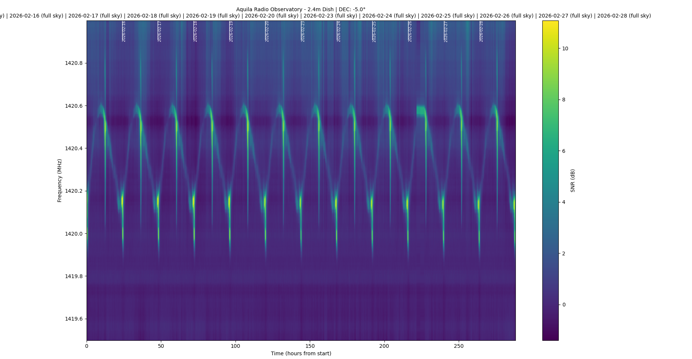
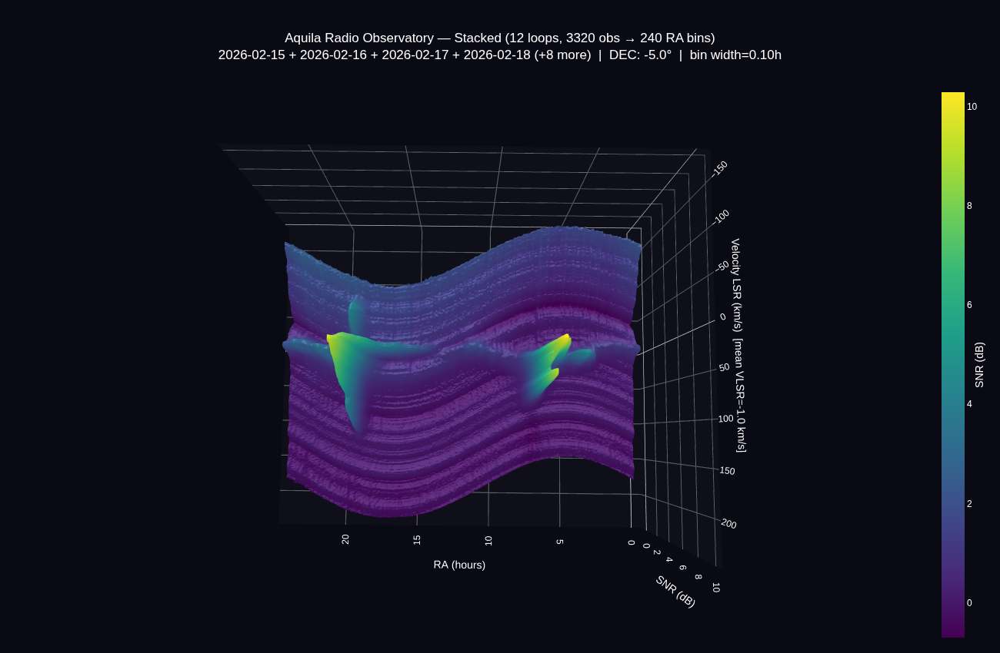

# H-Line Observer

> Automated hydrogen line data collection for Raspberry Pi · Requires [VIRGO](https://virgo.readthedocs.io/en/latest/examples.html) + GNU Radio

---

## Installation

Linux is recommended. Both scripts depend on [VIRGO](https://github.com/0xCoto/Virgo) which handles all the SDR acquisition under the hood.

### 1. GNU Radio + gr-osmosdr

Required for acquiring data from your SDR. Not needed if you only want to analyze existing `.dat` files.

```bash
sudo apt install gnuradio gr-osmosdr
```

To verify, open `gnuradio-companion` and check that **osmocom Source** appears in the Library panel on the right.

### 2. VIRGO

Install from PyPI:

```bash
pip install astro-virgo
```

This automatically installs **numpy**, **matplotlib**, and **astropy** — you do not need to install them separately.

Or install from source:

```bash
git clone https://github.com/0xCoto/Virgo.git
cd Virgo
pip install .
```

Verify:

```bash
python -c "import virgo"
```

No output means it worked.

> **Troubleshooting:** If you get `ImportError: No module named virgo`, there is likely a mismatch between your `pip` and `python` versions. Fix it with:
> ```bash
> python -m pip install astro-virgo
> ```
> On newer Debian/Ubuntu systems you may also need `--break-system-packages` or use a virtual environment.

---

## Which Script?

| | `h_quick.py` | `h_observer.py` |
|---|---|---|
| **Purpose** | Manual testing tool | Full automated pipeline |
| **Use case** | Run it once, pick an option, observe. Good for checking your setup works before going automated. | Runs 24/7 as a background service, creates daily folders, auto-resumes after power cuts. |

---

## `h_quick.py` — Manual

1. **Check gains at the top of the file**
   Defaults to **Airspy Mini / R2** — if that's your SDR you don't need to change anything. Otherwise edit `DEVICE`, `RF_GAIN`, `IF_GAIN`, `BB_GAIN` to match your hardware.

2. **Run it**
   ```bash
   python3 h_quick.py
   ```

3. **Record a calibration first**
   Choose option 3, point dish at cold sky, press Enter.

4. **Take an observation**
   Option 1 for single, option 2 for continuous loop. Select your saved calibration when asked.

> **Note:** Data saves to `~/hydrogen_obs/` — edit `OUTPUT_BASE` at the top to change this.

---

## `h_observer.py` — Automated

1. **Install and set up the service**
   ```bash
   python3 h_observer.py --install
   ```

2. **Set your SDR and output folder**
   ```bash
   python3 h_observer.py --config
   ```
   Pick your hardware preset (Airspy Mini, RTL-SDR, HackRF, etc.) and where to save data.

3. **Record a calibration**
   ```bash
   python3 h_observer.py
   ```
   Choose option 3, point dish at cold sky, press Enter.

4. **Start the service**
   ```bash
   systemctl --user start h_observer
   systemctl --user status h_observer
   ```
   The service starts automatically on every login from now on.

> **Note:** To watch live logs: `journalctl --user -u h_observer -f` · To stop: `systemctl --user stop h_observer`

---

## Output

Each loop creates a folder: `~/hydrogen_obs/loop_YYYYMMDD_HHMMSS/`

Inside: one `.dat` file and one `.png` plot per observation, plus a `loop_info.txt` with settings.

Calibrations are saved separately under `~/hydrogen_obs/cal_*/` and indexed in `.calibrations.json`.

---

## Results

Collected with a 2.4m dish at Aquila Radio Observatory using these scripts:





---

## Data

These scripts were used to collect 21 cm hydrogen line data with a 2.4-meter radio telescope dish at Aquila Radio Observatory. The datasets are openly published on Zenodo:

[](https://doi.org/10.5281/zenodo.18847536) — **Hydrogen Line 21cm Drift Scan, February 2026**
3,320 observations across 12 sidereal loops · Corrected spectra + raw CSV · 2.4m dish + Airspy Mini

Browse all datasets: [Tripathi, Ayushman on Zenodo](https://zenodo.org/search?q=metadata.creators.person_or_org.name%3A%22Tripathi%2C%20Ayushman%22&l=list&p=1&s=10&sort=bestmatch)

---

## Contact

If you run into any issues with the scripts or have questions, feel free to reach out at ayushman_tripathi@icloud.com

---

Copyright (c) 2026 Ayushman Tripathi · MIT License
